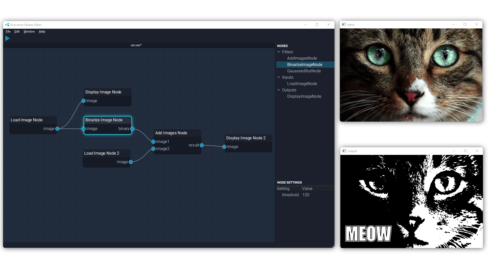

#  NodeEditor

A multi purpose node editor for flow-based programming.

## Description

The purpose of this node editor is to connect functional building blocks and parameterize them in order to form a graph which can then be executed using the execution subsystem.  

### Execution Subsystem
For running the graph created with the node editor the so called `execution subsystem` written in C++ is used. It is based on the [ExecutionNodes](https://github.com/beyse/ExecutionNodes) flow-based programming library also done by me. (Please note the repository is not publicly available yet)

If you want, you could swap the execution subsystem shipped in the Releases by your own system. It just needs to understand the node editor's output format of the graph.

### Node Type Definition

At the present moment the nodes available in the node editor is limited to only a couple of image processing nodes. You can add your own node types by adding a `JSON File` to a subfolder of
`apps\execution_node_editor\execution_subsystem\node_type_definitions` containing your node attributes.
Here is one example:
```json
{
    "node_type": "GaussianBlurNode",
    "input_ports": [
      {
        "port_name": "image",
        "data_type": "image_t"
      }
    ],
    "output_ports": [
      {
        "port_name": "blurred",
        "data_type": "image_t"
      }
    ],
    "default_settings": 
    {
      "sigma": 1.0
    }
}
```

### Output Formats
The node editor creates two files
* The `Scene` with the file extension `.nes` saves the entire scene containing nodes, edges, node settings, viewport settings and user interface settings. It is designed to be loaded again by the node editor.
* The `Graph` with the file extension `.graph.json` saves only the nodes, edges and node settings. It is designed to be an exchange format for the execution subsystem and running the graph.

## License
This software is licensed under [MIT License](https://opensource.org/licenses/MIT).

## How To Build

### Prerequisits
- Anaconda or Miniconda. Get it from: https://docs.conda.io/projects/conda/en/latest/user-guide/install/index.html
- On **Windows only** you need Inno Setup for creating the Installer. Get it from: https://jrsoftware.org/isdl.php. Install it after you downloaded it. 

### Step 1
Create conda environment using
```
conda env create -f environment.yml
```
This will create a new conda environment called `editor`. Now activate the environment using
```
conda activate editor
```

### Step 2
Install randomname

Randomname is used to create random file names by the editor.
[This fork](https://github.com/beyse/randomname) of the [original](https://github.com/beasteers/randomname) package is used.

Install it by cloning the [randomname](https://github.com/beyse/randomname) and then running. You need to take the fork because the original version can not be installed using the PyInstaller.

Clone the repository:
```
git clone git@github.com:beyse/randomname.git
cd randomname
```

Make sure that the `editor` environment is activated and run:
```
python setup.py install
```
### Step 3
Now run the packaging script in a Terminal with the conda environment `editor` activated.

For **Windows** run:
```
.\pack.bat
```

For **Linux** or **macOS** run:
```
./pack-ubuntu.sh
```

### After you are done
You should now see the `dist` folder. It contains the executable file `ExecutionNodeEditor` or `ExecutionNodeEditor.exe` on Windows alongside with the two folders `assets` and `execution_subsystem`.

- On **Windows** it contains the Installer `Setup ExecutionNodeEditor.exe`.
- On **Linux** or **macOS** it contains a ZIP file called `ExecutionNodeEditor` which can be shipped.

## Credits
- This node editor is based on `pyqt-node-editor` by [Pavel Křupala](https://gitlab.com/pavel.krupala). Visit the original [repository](https://gitlab.com/pavel.krupala/pyqt-node-editor) on GitLab. 

- The code contains a modified version of [PyQJsonModel](https://github.com/GrxE/PyQJsonModel) 


## Contribution

If you would like to contribute please read this [Contribution Guide](CONTRIBUTING.md)  

## Reachout

Feel free to contact me if you have any questions: sebastian.beyer@live.com

[](https://www.buymeacoffee.com/beyse)
